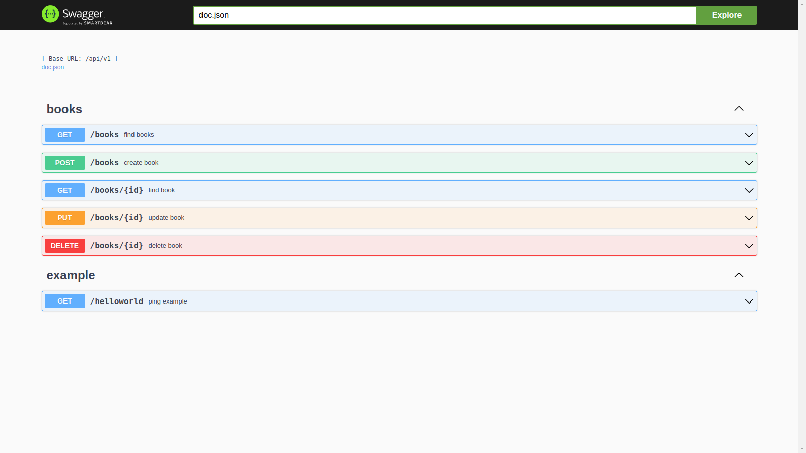

# golang-rest-api-template
Template for REST API made with Golang using Gin framework. Includes Docker container integrated with PostgreSQL database.

## Dependencies

  - Docker
  - Docker compose

## Running

`make setup && make build`

 - Base URL: `http://localhost:8001/api/v1`
 - Swagger URL: `http://localhost:8001/swagger/index.html#/`

Endpoints:
 - GET /books
 - POST /books
 - GET /books/id
 - PUT /books/id
 - DELETE /books/id

 ## Middleware

  - security
  - CORS headers
  - XSS sanitizer

 ## Swagger

 